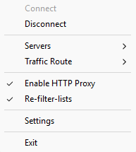
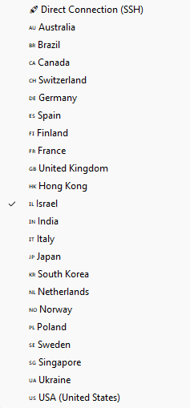
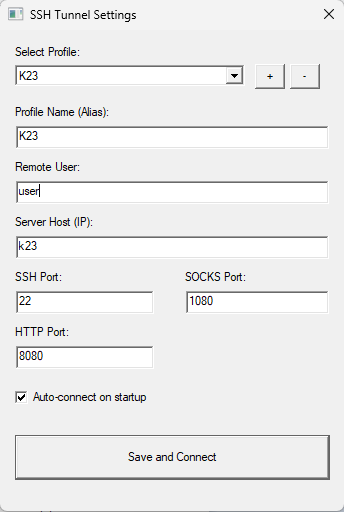

# SSH Proxy: Hybrid Direct & Tor Tunnel

**SSH Proxy** — это продвинутое и легковесное приложение для Windows, которое превращает ваш SSH-сервер в мощный SOCKS5 прокси-шлюз. Оно позволяет работать как напрямую через IP сервера, так и через сеть Tor с возможностью выбора страны выхода прямо из системного трея.

**Новое: Умная фильтрация и оффлайн-кеш!** — Включите "Re-filter-lists", чтобы пускать через прокси только определенные заблокированные домены и IP. Списки автоматически кешируются локально, поэтому прокси остается работоспособным, даже если источник списков временно недоступен.





## 🌟 Основные возможности

- 🌍 **Multi-Country Tor Exit Nodes** — Выбирайте из более чем 21 стран (US, DE, FR, IL, JP, SG и др.). Трафик пойдет по цепочке: `PC -> SSH Tunnel -> Remote Tor -> World`.
- 🚀 **Hybrid Modes** — Мгновенное переключение между "Direct" (чистый SSH) и "Tor" (анонимность) режимами.
- 🛡️ **Умная фильтрация трафика** — Режим "Re-filter" позволяет направлять в туннель только запросы к ресурсам из списков блокировок, оставляя остальной трафик прямым для максимальной скорости.
- 💾 **Оффлайн-кеш** — Скачанные списки фильтрации сохраняются на диск. Если при запуске нет интернета или недоступен GitHub, приложение загрузит последнюю сохраненную версию.
- 🌐 **Встроенный HTTP прокси** — Включите HTTP прокси вместе с SOCKS5 для приложений, которые не поддерживают SOCKS.
- 🛠️ **Zero-Config Server Side** — Приложение само проверит наличие Tor на сервере, установит его (Debian/Ubuntu) и настроит изолированный инстанс, не затрагивая системные настройки сервера.
- 🔐 **Smart Key Management** — Автоматическая генерация RSA-ключей и их безопасная доставка на сервер (пароль нужен только один раз).
- 📝 **Диагностические логи** — Все решения по маршрутизации (что пошло через прокси, а что напрямую) и ошибки записываются в папку AppData.
- 🧹 **Clean Exit** — При отключении приложение автоматически завершает свои процессы Tor на сервере.

## 🚀 Как это работает?

1. **Direct Mode**: Использует стандартный динамический проброс портов SSH (`-D`).
2. **Tor Mode**: 
   - На сервере запускается изолированный процесс Tor.
   - Создается SSH-туннель (`-L`), соединяющий ваш компьютер с этим портом Tor.
   - Трафик выходит в интернет через выбранную страну (`ExitNodes`).
3. **Filter Mode**: Если включен "Re-filter", приложение работает как умный диспетчер SOCKS5, проверяя каждый запрос по базе доменов и IP для выбора пути.

## 📥 Установка

1. Скачайте последнюю версию из [Releases](https://github.com/USERNAME/REPO_NAME/releases)
2. Распакуйте `ssh_proxy.exe` в любую удобную папку.
3. Запустите файл.
4. **Совет**: Для автозапуска при включении ПК добавьте ярлык программы в папку `shell:startup`.

## 🛠️ Использование

1. **Setup**: Правой кнопкой по иконке в трее → **Settings**. Введите данные вашего сервера.
2. **Select Route**: В меню **Traffic Route** выберите "Direct" или желаемую страну.
3. **Включение фильтра**: Отметьте **Re-filter-lists** в меню трея для работы только по спискам заблокированных сайтов.
4. **Connect**: Нажмите **Connect**. Индикатор в трее станет зеленым при успешном подключении.
5. **Настройка прокси**: 
    - **SOCKS5**: Установите в приложении SOCKS5 прокси: `127.0.0.1:1080` (порт по умолчанию).
    - **HTTP**: Установите в приложении HTTP прокси: `127.0.0.1:8080`.

### Параметры настройки

| Параметр | Описание | По умолчанию |
|----------|----------|--------------|
| User | SSH-пользователь | `ubuntu` |
| Host | IP или домен сервера | — |
| SSH Port | Порт SSH сервера | `22` |
| SOCKS Port | Локальный SOCKS5 порт | `1080` |
| HTTP Port | Локальный HTTP порт | `8080` |
| Bind Address | Локальный IP для прокси (например, 127.0.0.1) | `127.0.0.1` |
| Autostart | Автосоединение при запуске | `false` |

## 📁 Пути и логи

Конфигурация, логи и кеш находятся по адресу:
`%APPDATA%\ssh-socks-tray\`

- `logs/debug.log`: Общая работа приложения и ошибки.
- `logs/proxy.log`: История запросов, прошедших через прокси, с указанием причины.
- `filters/*.cache`: Сохраненные списки фильтрации.

## 🏗️ Сборка из исходников

### Требования
- Go 1.25+
- Наличие `ssh` клиента в системе.

### Компиляция
```bash
go build -ldflags "-H=windowsgui -s -w" -o ssh_proxy.exe .
```

## ⚠️ Требования к серверу
- ОС: Debian, Ubuntu или аналоги с `apt`.
- Права: Sudo (только для первой установки Tor).
- На сервере разрешен локальный трафик на порт 9060.

## 📄 Лицензия
MIT License — см. файл [LICENSE](LICENSE)
